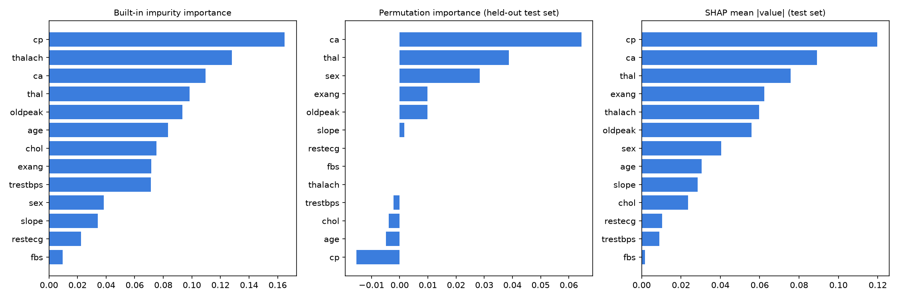
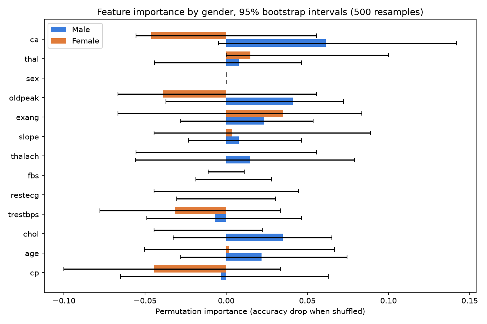

# A Visual Analysis of Heart Disease Prevalence

[](https://github.com/VrundaJoshi25/heart-disease-tableau-dashboard/actions/workflows/ci.yml)

> **Interactive dashboard (Tableau Public):** [TODO: paste the published link here; build instructions in `tableau/build_spec.md`]
>
> **Question:** Which clinical and symptom patterns are associated with heart disease, and do those patterns differ between men and women?

Team project for **DS612: Interactive Data Visualization** (Autumn 2026), M.Sc. Data Science, Dhirubhai Ambani University. Presented in class with the course instructor as project jury.

---

## Quickstart

```bash
git clone https://github.com/VrundaJoshi25/heart-disease-tableau-dashboard.git
cd heart-disease-tableau-dashboard
pip install -r requirements.txt
python -m src.run_analysis
```

One command reproduces every number in this README: cleaned dataset, held-out evaluation, three importance rankings, the gender analysis with bootstrap intervals, the Tableau-ready exports, and all figures. Seed is fixed at **42** (`src/config.py`); package versions are pinned (`requirements.txt`). `notebooks/analysis.ipynb` tells the same story interactively.

## Dataset

- **Source:** [Kaggle: Heart Disease Dataset](https://www.kaggle.com/datasets/johnsmith88/heart-disease-dataset) (file `heart.csv`; UCI/Statlog heart-disease family: Cleveland, Hungary, Switzerland, Long Beach VA, collected 1988)
- **Downloaded:** 2026-09-27. SHA-256 `DDB2996B2F4DB2E00AAD13F4518200179FF69F79093838E3C21FFA672EBEC0F1`
- **Raw size:** 1,025 rows × 14 columns (13 features + target)
- **Unique patients: 302.** See the audit below; it changed every result in this project.
- `data/raw/heart.csv` is never edited. `src/data.py` validates schema, value ranges, and missing values (there are none), removes exact duplicate records, and writes the analysis copy to `data/clean/heart_clean.csv` (302 rows): every transformation is code, traceable.

### Data-quality audit (read this before the results)

The raw file circulating on Kaggle lists 1,025 rows, but **723 of them are exact duplicate patient records**: every patient appears 3 to 4 times (187 patients ×3, 114 ×4, one ×8). Only 302 unique patients exist, matching the size of the classic Cleveland cohort this file derives from.

Left in, the copies break evaluation. A random 80/20 split of the 1,025 rows places **202 of the 205 test rows (99%) as identical twins of training rows**, so the model is tested on patients it has literally already seen. That is how this project briefly reported a perfect accuracy of 1.000: it was measuring memorization, not generalization.

The fix is in `src/data.py`: drop exact duplicates (keep the first occurrence) **before** anything else, then split. Every number below is computed on the 302 unique patients. A regression test (`tests/test_pipeline.py::test_no_patient_leaks_across_the_split`) keeps it that way.

What the leak had been hiding:

| | With duplicates (leaked) | After dedup (honest) |
|---|---|---|
| Held-out accuracy | 1.000 | **0.787** |
| ROC-AUC | 1.000 | **0.865** |
| `ca` gender gap | "supported" (non-overlapping intervals) | intervals overlap: **suggestive only** |

The honest numbers are less glamorous and far more valuable: they are the ones that survive an interview.

### Data dictionary

| Column | Type | Meaning |
|---|---|---|
| `age` | numeric | Age in years (29-77) |
| `sex` | nominal | 0 = Female (96 patients), 1 = Male (206) |
| `cp` | nominal | Chest-pain type: 0 typical angina, 1 atypical angina, 2 non-anginal pain, 3 asymptomatic |
| `trestbps` | numeric | Resting blood pressure (mm Hg) |
| `chol` | numeric | Serum cholesterol (mg/dl) |
| `fbs` | nominal | Fasting blood sugar > 120 mg/dl (1 = yes) |
| `restecg` | nominal | Resting ECG: 0 normal, 1 ST-T abnormality, 2 LV hypertrophy |
| `thalach` | numeric | Maximum heart rate achieved |
| `exang` | nominal | Exercise-induced angina (1 = yes) |
| `oldpeak` | numeric | ST depression induced by exercise relative to rest |
| `slope` | ordinal | Slope of peak-exercise ST segment: 0 upsloping, 1 flat, 2 downsloping |
| `ca` | ordinal | Major vessels colored by fluoroscopy (0-4) |
| `thal` | nominal | Thalassemia test: 0 unknown, 1 fixed defect, 2 normal, 3 reversible defect |
| `target` | nominal | Heart disease diagnosis: 0 = no disease (138), 1 = disease (164) |

Disease prevalence: **54.3%** overall; 75.0% among female patients, 44.7% among male patients in this dataset.

**Coding caveat.** In this circulating file, the marginal association of several variables (`ca`, `thal`, `exang`, `oldpeak`) with the target runs **opposite** to the classic UCI Cleveland cohort (for example, higher `ca` values coincide with *lower* target rates here). We therefore report patterns in the file's own coding and make no clinical-direction claims; for coded categoricals like `thal`/`cp`, "higher" reads across category codes, not a clinical scale.

## Method

0. **Audit first.** Validate ranges, then drop the 723 exact duplicate records (302 unique patients) so no patient can appear in both train and test.
1. **Split before anything else.** 241 train / 61 held-out test, stratified (disease ratio 0.544 train / 0.541 test), seed fixed. The test set is locked away until evaluation.
2. **Random Forest** (500 trees) trained on the training set only, to rank feature importance.
3. **Feature importance, three ways:**
   - *Built-in impurity importance*: shown for completeness; it is biased toward continuous features and splits credit between correlated ones.
   - *Permutation importance on the held-out test set*: shuffle one feature at a time, measure the accuracy drop. The honest ranking, and the one the dashboard shows.
   - *SHAP values*: same "what matters" question, with direction attached (does a higher value push the modeled risk up or down?).
4. **Evaluate on the held-out test set** (accuracy, confusion matrix, ROC-AUC) as the trust gate for the importance rankings. We say *"predicts"* only because it was measured on patients the model never saw; patterns merely observed in the data are *"associated with"*.
5. **Gender analysis with a floor under it.** Permutation importance recomputed separately within the male and female subgroups (163 M / 78 F train, 43 M / 18 F test), each with **500 bootstrap resamples** → a 95% interval per feature per gender. Non-overlapping intervals = the difference is supported; overlapping intervals = *suggestive, not conclusive* at this sample size.

## Results

### Held-out evaluation (61 patients the model never saw)

| Metric | Value |
|---|---|
| Accuracy | **0.787** (48/61) |
| ROC-AUC | **0.865** |
| Confusion matrix | 22 true negatives, 26 true positives, 6 false positives, 7 false negatives |

This is the honest performance band for this cohort (published leak-free evaluations typically land in the 0.80-0.90 range). The perfect score reported earlier was the duplicates, not the model (see the audit above).

### What drives the predictions (permutation importance, held-out test set)

| Rank | Feature | Importance (accuracy drop) |
|---|---|---|
| 1 | `ca` (vessels colored) | 0.064 |
| 2 | `thal` (thalassemia test) | 0.039 |
| 3 | `sex` | 0.028 |
| 4 | `oldpeak` (ST depression) | 0.010 |
| 5 | `exang` | 0.010 |
| 6 | `slope` | 0.002 |
| 7-9 | `thalach`, `fbs`, `restecg` | 0.000 |
| 10-13 | `trestbps`, `chol`, `age`, `cp` | ≤ 0 (within noise) |

Two honest subtleties, stated plainly:

- `cp` (chest-pain type) looks dominant under impurity importance (0.165) and SHAP (0.120) but does **not** survive held-out permutation at n = 61: permuting it leaves accuracy unchanged, because the forest routes the same information through correlated features. That disagreement between methods is itself a finding, and it is why the dashboard shows the permutation ranking.
- `sex` ranks 3rd on held-out data: a real standalone signal in this dataset, on top of its role in *modifying* which features matter (next section).

SHAP adds direction (in the file's own coding, per the caveat above): higher `cp` code and higher `thalach` push the modeled risk up; higher `oldpeak`, `ca`, `age`, `chol` push it down.



### Feature importance by gender (500 bootstrap resamples per subgroup)

Subgroup test sets are small (43 men, 18 women), so intervals are wide; that is the honest state of the evidence at n = 302.

| Feature | Male importance [95% CI] | Female importance [95% CI] | Verdict |
|---|---|---|---|
| `ca` | **0.061 [-0.005, 0.142]** (rank 1) | -0.046 [-0.056, 0.056] | Suggestive |
| `oldpeak` | 0.041 [-0.037, 0.072] (rank 2) | -0.039 [-0.067, 0.056] | Suggestive |
| `chol` | 0.035 [-0.033, 0.065] (rank 3) | 0.000 [-0.044, 0.022] | Suggestive |
| `exang` | 0.023 [-0.028, 0.054] (rank 4) | **0.035 [-0.067, 0.084]** (rank 1) | Suggestive |
| `thal` | 0.008 [-0.044, 0.047] (rank 8) | **0.015 [0.000, 0.100]** (rank 2) | Suggestive |

**Reading:** the rankings differ descriptively (men lean on `ca` and `oldpeak`; women lean on `exang` and `thal`), but **every interval overlaps, so no gender difference is statistically supported at this sample size**. Before the duplicate cleanup, the `ca` gap looked supported with non-overlapping intervals; removing the leak erased it. Both versions are reported here on purpose: the first shows what leakage manufactures, the second shows what the data actually carries. The descriptive pattern is a hypothesis for a larger cohort, not a finding.



## Interactive dashboard

The dashboard rebuilds the project's three views from these outputs (`tableau/build_spec.md` has click-by-click build + publish instructions):

1. **Feature importance, side by side for men and women**: the finding, visualized (from `data/processed/tableau/tableau_feature_importance.csv`).
2. **Prevalence heatmap**: chest-pain type × exercise-induced angina, split by gender.
3. **Grouped bars**: disease prevalence across clinical categories.

**Interactive filters (exact list): Gender, Age group, Chest-pain type.**

- Published link: [TODO: Tableau Public URL goes here]
- Published screenshot: `tableau/dashboard_overview.png` *(added once live)*
- Original course-version screenshots: `tableau/original_screenshots/`

## Tests and automation

`pytest tests/` runs four checks on every push via GitHub Actions (plus a `ruff` style check): the clean dataset is exactly 302 × 14 with **no duplicate patient records**, the split preserves the disease ratio in both halves (241/61), **no patient record appears in both train and test** (the leakage regression test), and every importance table covers all 13 features. Badge at the top of this file.

## Repository layout

```
data/raw/              original Kaggle CSV, never edited
data/clean/            validated, de-duplicated analysis copy (created by code)
data/processed/        importance tables, evaluation metrics (created by code)
data/processed/tableau/ Tableau-ready exports
src/                   analysis modules (config, data, split, model, importance, gender, tableau_export, run_analysis)
notebooks/             analysis.ipynb: the story, importing from src
figures/               charts generated by the pipeline
tableau/               build spec, published-dashboard screenshot, original screenshots
tests/                 pytest pipeline checks
.github/workflows/     CI: pytest + ruff on every push
```

## Team

| Name | Student ID | Role |
|---|---|---|
| **Vrunda Joshi** | 202518043 | **Team lead** |
| Meet Gandhi | 202518023 | Team member |
| Kashyap Patel | 202518036 | Team member |
| Masum Udecha | 202518058 | Team member |

Presented to the class in Autumn 2026 with the course instructor as project jury.

## Reproducibility

Python 3.13, seed 42 everywhere (`src/config.py`), pinned versions in `requirements.txt`. A stranger who clones this repo and runs `python -m src.run_analysis` gets exactly these tables, figures, and rankings.
